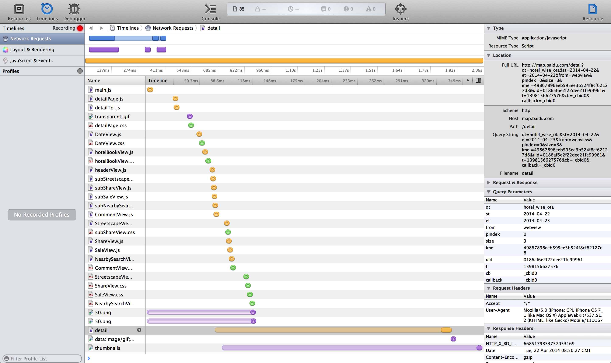
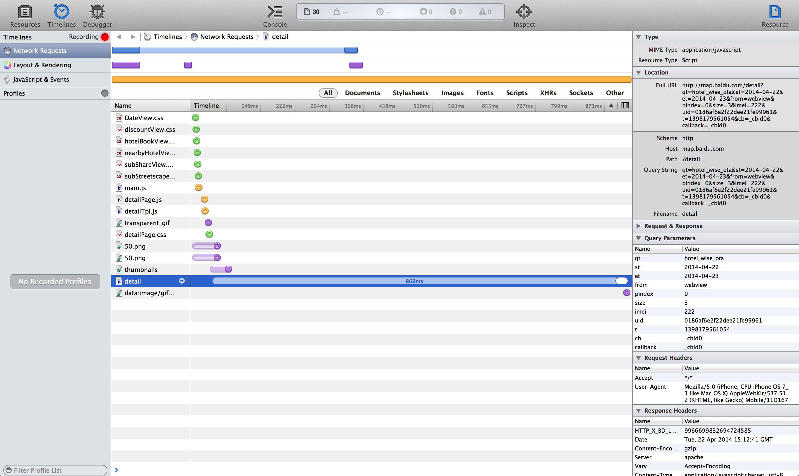

## webSDK插件预加载调研

###结论(TL;DR)
- 节省了什么时间
	- 资源并行加载时间(假设最大并行数目为6)，如一个插件大致花费50ms，有20个插件资源文件加载，节约时间为** 20 / 6 * 50 ~=166ms **
	- 个人认为虽然从酒店组件部分(下图皆是酒店组件截图)看出的提升效果不太明显，但是随着组件的复杂度提升，插件预加载能将所有插件加载时间维持在一个比较稳定的数字级别里面
	
### The Old Way
- 运行时动态加载

- 存着问题
	- 因为webview可开连接数有限，发出数据请求时间已经渲染开始时刻都被插件加载所限制
		 	
###The New Way
- 插件预加载

- 基本策略是减少js文件动态加载数目，减至一次可并行数目

###Dive a little deeper(TODO)
- Css资源合并
- Native浏览器壳预加载

###调研存着问题
- 模拟环境非真机,存着一定误差，特别是请求资源并行数目